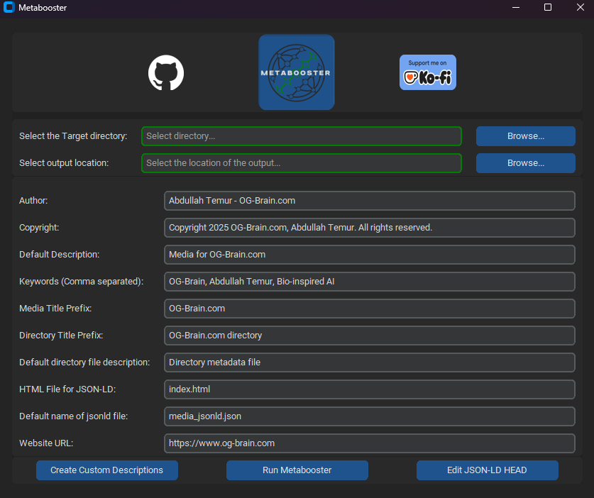

<p align="center"></p>
<p align="center"><strong>Metabooster -- Alpha</strong></p>


**Metabooster** is a tool that automatically adds metadata to supported files within a specified directory. It
is designed to facilitate consistent metadata improving cross-referencing on the internet.

---

<!-- TOC -->
* [Metabooster](#metabooster)
  * [Features](#features)
  * [Supported Files and Tags](#supported-files-and-tags)
  * [Displaying the Metadata: `Windows 11` Default Properties Menu and `KDE Plasma (Dolphin)` (Tested on Fedora)](#displaying-the-metadata-windows-11-default-properties-menu-and-kde-plasma-dolphin-tested-on-fedora)
  * [Displaying the Metadata: jExifToolGUI](#displaying-the-metadata-jexiftoolgui)
  * [Requirements](#requirements)
  * [Run from Source](#Run-from-Source)
  * [Run from Portable Binray (Linux)](#Run-from-Portable-Binary)

  * [Notes](#notes)
<!-- TOC -->

---

## Features

* **Metadata Injection**

    * Adds user-defined metadata to all supported files within the selected directory.
    * Injects metadata as comments into HTML and CSS files.
    * If appropriate the same metadata is reused for all supported files to maximize semantic linkage across content.

* **Directory Metadata**

    * Creates a `.metadata.yaml` file in each directory to store metadata contextually.
* **JSON-LD Generation**

    * Generates a `metadata.json` file containing a [JSON-LD](https://json-ld.org/) schema for use in HTML.
    * Optionally embeds the JSON-LD into a specified HTML file.
    * Supports custom descriptions for each media.
* **Non-destructive Operation**

    * Creates a copy of the original directory to preserve original content.
    * All operations are performed on the copied directory.
* ### New: GUI MODE
  * 
  * Custom descriptions editor for all supported files
  * JSON-LD Head Generator


---

## Supported Files and Tags

| File Type         | Supported Extensions    | Supported Metadata Tags                                                                                                   |
|-------------------|-------------------------|---------------------------------------------------------------------------------------------------------------------------|
| **Images**        | `.png`, `.jpg`, `.jpeg` | `Author`, `Artist`, `Title`, `Description`, `Copyright`, `Keywords`                                                       |
| **Images (HEIC)** | `.heic`                 | `Artist`, `Title`, `ImageDescription`, `Copyright`                                                                        |
| **Videos**        | `.mp4`                  | `Title`, `Artist`, `Copyright`, `Description`, `Keywords`                                                                 |
| **Videos (GIF)**  | `.gif`                  | `Title`, `Author`, `Comment`, `Rights` (copyright), `Subject` (keywords), `Description`, `Creator`                        |
| **HTML**          | `.html`                 | (added as comment on top of the file) `Author`, `Description`, `Copyright`, `Keywords`                                    |
| **CSS**           | `.css`                  | same as html                                                                                                              |
| **Directories**   |                         | Saved in `.metadata.yaml` as key-value pairs: `Title`, `Author`, `Copyright`, `Description`, `Keywords`, `Created` (date) |
| **Documents**     | `.pdf`                  | `Author`, `Creator`, `Title`, `Subject` (Description), `Producer`,  `Keywords`, `Copyright`, `Rights` (also Copyright)    |

---

## Displaying the Metadata: `Windows 11` Default Properties Menu and `KDE Plasma (Dolphin)` (Tested on Fedora)

> Some Metadata Tags aren't shown in the default File Properties Menu (even when the Tags are in the file).

| Extension | Windows 11 Displayed Tag                              | Missing on Windows 11                  | KDE Plasma Displayed Tags                                                        | Missing on KDE Plasma               | Common Missing Tags           |
|-----------|-------------------------------------------------------|----------------------------------------|----------------------------------------------------------------------------------|-------------------------------------|-------------------------------|
| `.png`    | N/A                                                   | ALL                                    | `Artist`, `Description`, `Copyright`                                             | `Author`, `Title`, `Keywords`       | `Author`, `Title`, `Keywords` |
| `.heic`   | ALL                                                   | –                                      | ALL                                                                              | –                                   | –                             |
| `.jpg`    | `Subject`, `Title`, `Author`, `Copyright`, `Markings` | `Artist`                               | `Artist`, `Copyright`, `Description`                                             | `Author`, `Title`, `Keywords`       | –                             |
| `.mp4`    | `Title`, `Artist`                                     | `Copyright`, `Description`, `Keywords` | `Title`, `Copyright`                                                             | `Artist`, `Description`, `Keywords` | `Description`, `Keywords`     |
| `.gif`    | N/A                                                   | –                                      | N/A                                                                              | –                                   | –                             |
| `.pdf`    | N/A                                                   | ALL                                    | `Title`, `Author`, `Document` (Creator/Producer/Author), `Subject` (Description) | `Keywords`, `Copyright`             | –                             |

---

## Displaying the Metadata: jExifToolGUI

| Extension | Displayed Metadata Tags                                                                                                | Matches with injection? |
|-----------|------------------------------------------------------------------------------------------------------------------------|-------------------------|
| `.png`    | `XP Author`, `Artist`, `XP Title`, `Description`, `Copyright`, `XP Keywords`                                           | True                    |
| `.heic`   | `Artist`, `(XMP) Title`, `ImageDescription`, `Copyright`                                                               | True                    |
| `.jpg`    | `XP Author`, `Artist`, `XP Title`, `Description`, `Copyright`, `XP Keywords`                                           | True                    |
| `.mp4`    | (Quicktime): `Title`, `Artist`, `Copyright`, `Description`, (User Data Key) `Keywords`                                 | True                    |
| `.gif`    | (XMP) `Title`, (XMP) `Author`, (File) `Comment`, (XMP) `Rights`, (XMP) `Subject`, (XMP) `Description`, (XMP) `Creator` | True                    |
| `.pdf`    | `Author`, `Creator`, `Title`, `Subject` (Description), `Producer`,  `Keywords`, `Copyright`, `Rights` (also Copyright) | True                    |

---

## Requirements

* Tcl/Tk runtime
* exiftool (https://exiftool.org/)
  * Fedora: pkcon install exiftool
* ffmpeg (https://ffmpeg.org/download.html)
* on windows add exiftool and ffmpeg to PATH
* Install required Python packages:

   ```bash
   pip install -r requirements.txt
   ```

---

## Run from Source

1. Clone this repository:

   ```bash
   git clone https://github.com/A-Temur/Metabooster.git
   ```
2. install requirements
3. run gui.py
---

---

## Run from Portable Binary

1. Download Metabooster_Linux archive from Releases and extract
2. double click on Metabooster

---


## Notes

* on each startup, the script saves the current timestamp. The same timestamp is used for all supported metadata in
  order to increase the cross-references.
